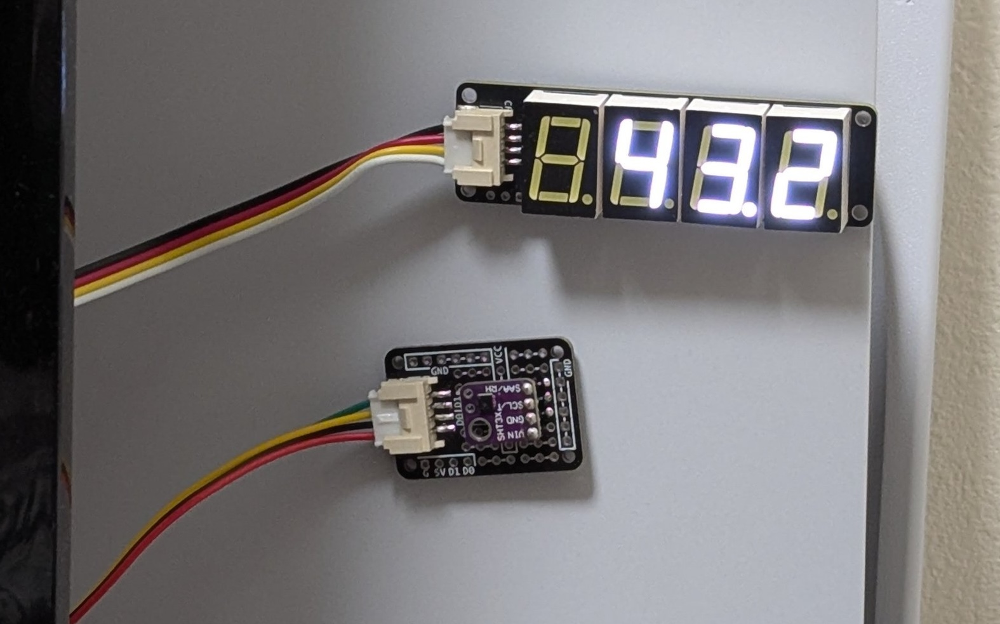
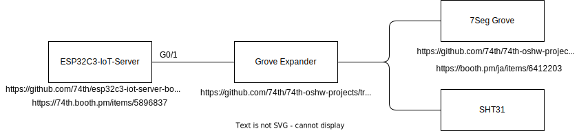

# SHT30で湿度を取得して、7セグLEDに表示する

https://x.com/74th/status/1879877191619772515

- ESP32C3-IoT-Server
  - https://github.com/74th/esp32c3-iot-server-board
  - https://74th.booth.pm/items/5896837
- Grove Expander
  - https://github.com/74th/74th-oshw-projects/tree/main/MISC-grove_expander
- 7Seg Grove
  - https://github.com/74th/74th-oshw-projects/tree/main/74TH-G060-7seg-grove
  - https://booth.pm/ja/items/6412203
- SHT31